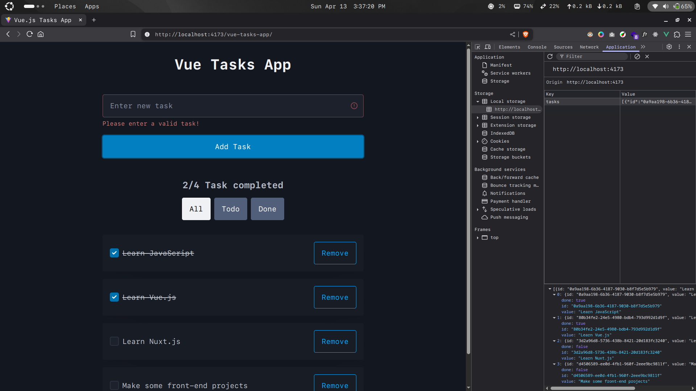

# Vue.js Tasks App

A simple tasks app built with [**Vue.js**]("https://vuejs.org/").

[**Live Preview**](https://ashmin-bhujel.github.io/vue-tasks-app/) of the app.

## Features

- [x] Pico CSS for simple yet responsive UI
- [x] Persists data using localstorage
- [x] Some subtle CSS transitions

## For Local Setup

### Prequisites

- [Node.js](https://nodejs.org/en/) installed on your machine.

- [PNPM](https://pnpm.io/) (Optional) for package management. You can use NPM which comes by default with Node.js.

### Steps

1. Clone the repository

2. If you're using package manager other than PNPM, delete `pnpm-lock.yaml` and `pnpm-workspace.yaml` files.

3. Install dependencies

   ```sh
   pnpm install
   ```

   or

   ```sh
   npm install
   ```

4. Run the app in dev mode

   ```sh
   pnpm run dev
   ```

   or

   ```sh
   npm run dev
   ```

5. Open your browser and go to `http://localhost:5173/`

## Preview


